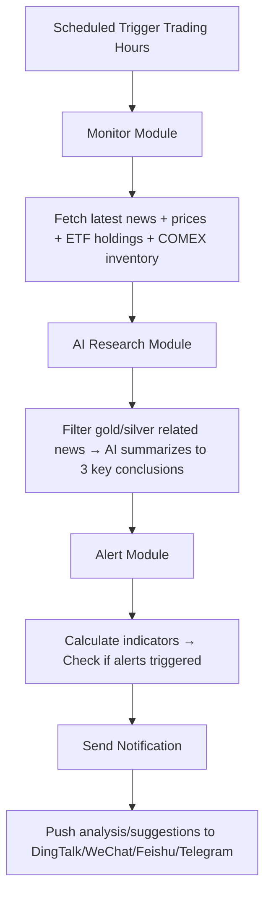

# gold-silver-finance-agent
[](https://opensource.org/licenses/MIT)

[English](./README-EN.md) | [中文文档](./README.md)

🤖 **AI-Powered Gold & Silver Active Monitoring Agent** - 24/7 automatic market monitoring, AI analysis, and anomaly alerts for precious metals markets. Sleep well while your code keeps an eye on gold & silver for you!

## 🎯 Project Philosophy

> AI in 2026 shouldn't just draw charts — it should **work actively** for you!

> Watching your code monitor gold & silver while you sleep — this sense of control is way more satisfying than watching short videos! 😎

## 🌟 Built-in Market Insights

| Asset | What We Monitor | Market Meaning |
|------|--------|------|
| **GLD** | Holdings Changes | World's largest gold ETF → reflects **retail investor sentiment** |
| **SLV** | Holdings Changes | World's largest silver ETF → reflects **institutional player positioning** |
| **COMEX Inventory** | Inventory Changes | Decreasing inventory = strong physical demand → bullish for prices |

## ✨ Core Features

- 👀 **Monitor While You Sleep** - Automatic scheduled execution, no need to stare at the screen every day
- 🧠 **AI-Powered Analysis** - Modular design, each module focuses on one job
- 📊 **Technical Indicator Analysis** - Built-in technical calculations, fully customizable alert rules
- 📰 **Multi-Source Data** - Tushare + WallStreetCN/Xueqiu news + COMEX inventory + GLD/SLV holdings
- 🔔 **Multi-Channel Notifications** - DingTalk/WeChat Work/Feishu/Telegram/Email
- 🛠️ **Highly Configurable** - Everything: alert rules, notification channels, all configurable
- 🐳 **One-Click Docker Deployment**

## Core Unique Insights (Yours Implemented)

> When SLV (silver ETF) holdings decrease significantly **and** COMEX silver inventory increases → this indicates institutional players are withdrawing physical silver from exchange → **strongly bullish signal** for silver prices!

## Project Structure

```
gold-silver-finance-agent/
├── src/
│   ├── monitor/          # Monitoring Module
│   │   ├── __init__.py
│   │   ├── news_monitor.py      # Macroeconomic news monitoring
│   │   └── price_monitor.py    # Prices + ETF Holdings + COMEX Inventory (via Tushare)
│   ├── research/         # AI Analysis Module
│   │   ├── __init__.py
│   │   └── report_summarizer.py  # News/Report summarization
│   ├── alert/           # Alert Analysis Module
│   │   ├── __init__.py
│   │   ├── indicator.py       # Technical indicator calculation
│   │   ├── trigger.py        # Alert trigger checking
│   │   └── etf_comex_analyzer.py  # ETF-COMEX correlation analysis
│   └── notifier/        # Notification Module
│       ├── __init__.py
│       └── sender.py    # DingTalk/WeChat Work/Feishu/Telegram/Email sender
├── config/
│   └── config.example.yaml
├── tests/               # Basic test cases
├── main.py              # Main entry
├── pyproject.toml       # uv project config
├── Dockerfile           # Docker image
├── docker-compose.yml   # Docker Compose
├── Makefile             # Helper commands
└── README.md
```

## Quick Start

### 1. Clone Project
```bash
git clone https://github.com/yourusername/gold-silver-finance-agent.git
cd gold-silver-finance-agent
```

### 2. Install Dependencies

We recommend using `uv`:
```bash
# Install uv
curl -LsSf https://astral.sh/uv/install.sh | sh

# Install dependencies
uv sync

# Install playwright browsers
uv run playwright install chromium
```

### 3. Configure
```bash
cp config/config.example.yaml config/config.yaml
# Edit and fill in:
#  - Tushare token
#  - OpenAI API key
#  - Gold/Silver switches
#  - Alert rules
#  - Notification channel config
```

### 4. Run Once
```bash
uv run python main.py --run-once
```

### 5. Start Scheduled Monitoring
```bash
uv run python main.py --schedule
```

### Docker Deployment
```bash
make docker-build
make docker-up
```

## Supported Technical Indicators

- MA Moving Average Deviation
- RSI Overbought/Oversold
- Bollinger Bands Breakout
- Volatility Threshold Anomaly
- Fully custom rules

## Workflow



## Development Quick Start

```bash
# Clone
git clone https://github.com/yourusername/gold-silver-finance-agent.git
cd gold-silver-finance-agent
make install
make install-browser
make test
```

## Fun Fact

> Watching your code monitor gold & silver while you sleep — this sense of control is way more satisfying than watching short videos! 😎

## Roadmap

- [ ] Complete GLD/SLV holdings data parsing
- [ ] Complete COMEX inventory data parsing
- [ ] Add more technical indicators
- [ ] Web UI for historical alerts
- [ ] Support more news sources
- [ ] LLM automatic operation suggestions

## Contributing

Issues and Pull Requests are welcome!

## License

MIT License - see [LICENSE](LICENSE) for details
