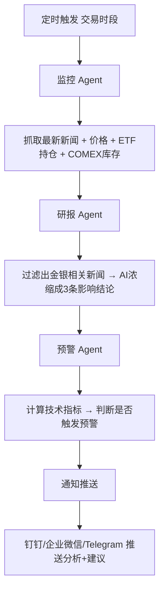

# gold-silver-finance-agent
[](https://opensource.org/licenses/MIT)

[English](./README-EN.md) | [中文文档](./README.md)

🤖 **AI 赋能黄金白银主动监控 Agent** - 24小时帮你盯着金银市场，睡觉时也能自动监控行情、分析新闻、推送异动预警

## 🎯 项目理念

> 2026 年的 AI 不再只是画 K 线图，而是帮你**主动干活**！

> 看着自己写的代码在睡觉时帮你盯着黄金白银，这种「掌控感」比看短视频爽得多！😎

✨ **监控 Agent**: 
- 24小时监控全球宏观新闻 
- **COMEX 黄金/白银库存变化**监控
- **GLD/SLV ETF 持仓变化**监控 (市场经验: GLD反映散户情绪，SLV反映庄家操作动向)

📑 **研报/新闻 Agent**: 
自动把长篇大论的财经新闻/研报浓缩成 **3条「对金银价格的具体影响」**

⚠️ **预警 Agent**: 
当金价/银价触发你设定的技术规则（均线背离/RSI超买超卖/波动率异常），直接**钉钉/企业微信/Telegram 推送操作建议**

## 🌟 市场经验内置

| 品种 | 监控点 | 市场含义 |
|------|--------|------|
| **GLD** | 持仓变化 | 全球最大黄金ETF → 反映**散户持仓情绪** |
| **SLV** | 持仓变化 | 全球最大白银ETF → 反映**庄家操作动向** |
| **COMEX 库存** | 库存变化 | 库存减少 → 实物需求旺盛，对价格利好 |

## 功能特色

- 👀 **睡觉也帮你盯着** - 定时自动运行，不用你天天盯盘
- 🧠 **Multi-Agent 协作** - 分工明确，每个Agent专注做一件事
- 📊 **技术指标分析** - 内置 ta-lib 技术指标计算，支持自定义预警规则
- 📰 **多数据源** - Tushare + 华尔街见闻/雪球新闻 + COMEX库存 + GLD/SLV持仓
- 🔔 **多渠道通知** - 钉钉/企业微信/Telegram 推送
- 🛠️ **高度可配置** - 预警规则、通知渠道全部可配置
- 🐳 **Docker 一键部署**

## 项目结构

```
gold-silver-finance-agent/
├── src/
│   ├── monitor/          # 监控模块
│   │   ├── __init__.py
│   │   ├── news_monitor.py      # 宏观新闻监控
│   │   └── price_monitor.py    # 金银价格 + ETF持仓 + COMEX库存监控 (Tushare)
│   ├── research/         # AI分析模块
│   │   ├── __init__.py
│   │   └── report_summarizer.py  # 新闻/研报浓缩总结
│   ├── alert/           # 预警分析模块
│   │   ├── __init__.py
│   │   ├── indicator.py       # 技术指标计算
│   │   ├── trigger.py        # 预警触发判断
│   │   └── etf_comex_analyzer.py  # ETF-COMEX关联分析
│   └── notifier/        # 通知模块
│       ├── __init__.py
│       └── sender.py    # 钉钉/企业微信/飞书/Telegram/邮件推送
├── config/
│   └── config.example.yaml
├── tests/               # 基础测试用例
├── main.py              # 主入口
├── pyproject.toml       # uv 项目配置
├── Dockerfile           # Docker 镜像
├── docker-compose.yml   # Docker Compose
├── Makefile             # 简化命令
└── README.md
```

## 快速开始

### 1. 克隆项目
```bash
git clone https://github.com/yourusername/gold-silver-finance-agent.git
cd gold-silver-finance-agent
```

### 2. 安装依赖

使用 uv 推荐：
```bash
# 安装 uv
curl -LsSf https://astral.sh/uv/install.sh | sh

# 安装依赖
uv sync

# 安装 playwright
uv run playwright install chromium
```

### 3. 配置
```bash
cp config/config.example.yaml config/config.yaml
# 编辑填入你的:
#  - Tushare token
#  - OpenAI API key
#  - 黄金/白银开关
#  - 预警规则
#  - 通知渠道配置
```

### 4. 运行一次
```bash
uv run python main.py --run-once
```

### 5. 启动定时监控
```bash
uv run python main.py --schedule
```

### Docker 部署
```bash
make docker-build
make docker-up
```

## 默认预警规则配置（针对黄金白银）

```yaml
alerts:
  # 黄金MA50偏离
  - name: "黄金MA50偏离"
    asset: gold
    enabled: true
    type: "ma_deviation"
    params:
      ma_period: 50
      threshold: 0.05  # 偏离超过5%触发
      direction: "both"
  
  # 白银MA50偏离
  - name: "白银MA50偏离"
    asset: silver
    enabled: true
    type: "ma_deviation"
    params:
      ma_period: 50
      threshold: 0.07  # 白银波动更大
      direction: "both"
  
  # 黄金 RSI 超买超卖
  - name: "黄金 RSI 超买超卖"
    asset: gold
    enabled: true
    type: "rsi"
    params:
      period: 14
      overbought: 70
      oversold: 30
  
  # 白银 RSI 超买超卖
  - name: "白银 RSI 超买超卖"
    asset: silver
    enabled: true
    type: "rsi"
    params:
      period: 14
      overbought: 75
      oversold: 25
  
  # 黄金波动率异常
  - name: "黄金波动率异常"
    asset: gold
    enabled: true
    type: "volatility"
    params:
      window: 20
      threshold: 2.0  # 波动率超过2倍历史均值触发
  
  # 白银波动率异常
  - name: "白银波动率异常"
    asset: silver
    enabled: true
    type: "volatility"
    params:
      window: 20
      threshold: 2.5  # 白银波动率更大
  
  # GLD持仓异动（散户情绪）
  - name: "GLD 持仓异动 (散户情绪)"
    asset: gld
    enabled: true
    type: "volatility"
    params:
      window: 5
      threshold: 1.5  # 持仓变化超过1.5倍日均变化触发
  
  # SLV持仓异动（庄家动向）
  - name: "SLV 持仓异动 (庄家动向)"
    asset: slv
    enabled: true
    type: "volatility"
    params:
      window: 5
      threshold: 1.5  # 持仓变化超过1.5倍日均变化触发
```

## 技术指标支持

- MA 均线偏离
- RSI 超买超卖
- Bollinger Bands 布林带突破
- 波动率阈值异常
- 完全自定义规则

## 工作流程



## 快速开始开发

```bash
# 克隆
git clone https://github.com/你的用户名/gold-silver-finance-agent.git
cd gold-silver-finance-agent
make install
make install-browser
make test
```

## 趣味点

> 看着自己写的代码在睡觉时帮你盯着黄金白银，这种「掌控感」比看短视频爽得多！😎

## 路线图

- [ ] 完整解析 GLD/SLV 持仓数据
- [ ] 完整解析 COMEX 库存数据
- [ ] 添加更多技术指标
- [ ] Web 界面查看历史预警
- [ ] 支持更多新闻源
- [ ] LLM 自动生成操作建议

## 贡献

欢迎提交 Issue 和 Pull Request！

## 许可证

MIT License - 详见 [LICENSE](LICENSE) 文件
